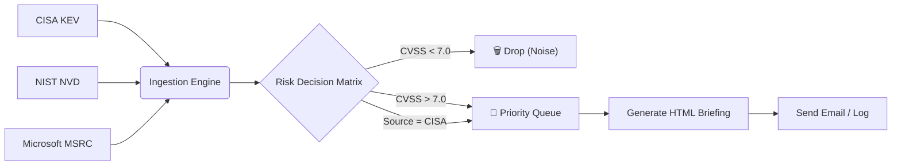

# 🛡️ AI Threat Intel & Vulnerability Monitor


**An automated Cyber Threat Intelligence (CTI) agent that aggregates vulnerabilities from multiple authoritative sources (CISA, NVD, Microsoft), filters out the noise, and delivers an Executive Briefing to security leadership.**

Most threat feeds are noisy firehoses. This agent acts as a **Level 1 Analyst**, applying a strict **Risk Decision Matrix** to determine if a vulnerability requires immediate attention (e.g., "Active Exploitation" or "CVSS > 7.0") before generating an alert.

## ✨ Key Features

* **🌐 Multi-Source Aggregation:** Ingests data from **CISA KEV**, **NIST NVD**, and **Microsoft MSRC** (Mocked for Demo).
* **🧠 Risk Decision Matrix:** Automatically prioritizes threats based on:
    * **Criticality:** CVSS Score > 7.0
    * **Credibility:** Source Priority (e.g., CISA warnings override CVSS scores).
* **📧 Executive Briefings:** Generates clean, HTML-formatted email reports suitable for CISOs and Security Directors.
* **⏰ Flexible Scheduling:** Runs as a standalone daemon (daily at 08:00) or as a "run-once" task for CI/CD pipelines.

## 🛠️ Architecture


```mermaid
graph LR
    A[CISA KEV] --> D(Ingestion Engine)
    B[NIST NVD] --> D
    C[Microsoft MSRC] --> D
    
    D --> E{Risk Decision Matrix}
    
    E -->|CVSS < 7.0| F["🗑️ Drop (Noise)"]
    E -->|CVSS > 7.0| G["🚨 Priority Queue"]
    E -->|Source = CISA| G
    
    G --> H[Generate HTML Briefing]
    H --> I[Send Email / Log]
```

## 🚀 Usage

### 1. Installation

```bash
git clone [https://github.com/codyjkeller/ai-threat-intel-agent.git](https://github.com/codyjkeller/ai-threat-intel-agent.git)
cd ai-threat-intel-agent
pip install -r requirements.txt
```

### 2. Configuration

The agent is driven by `config/settings.json`. You can define which sources are treated as "Critical" priority.

```json
{
  "sources": [
    { "name": "CISA Known Exploited Vulnerabilities", "priority": "CRITICAL" },
    { "name": "NIST NVD", "priority": "HIGH" },
    { "name": "Microsoft MSRC", "priority": "MEDIUM" }
  ]
}
```

### 3. Run the Monitor

**Option A: Daemon Mode (Scheduler)**
Runs continuously and executes the scan every day at 08:00 AM.
```bash
python src/daily_briefing.py
```

**Option B: CI/CD Mode (One-Shot)**
Runs the scan once and exits (perfect for GitHub Actions or Cron jobs).
```bash
python src/daily_briefing.py --run-once
```

## 📊 Sample Output

### CLI Console Logs

```text
2026-01-07 08:00:01 - [INTEL_AGENT] - Starting Scheduler (Runs daily at 08:00)...
2026-01-07 08:00:01 - [INTEL_AGENT] - --- Starting Threat Scan Cycle ---
2026-01-07 08:00:01 - [INTEL_AGENT] - Starting ingestion from 3 sources...
2026-01-07 08:00:01 - [INTEL_AGENT] - MATCH: CVE-2025-1001 flagged due to Source Priority (CRITICAL)
2026-01-07 08:00:01 - [INTEL_AGENT] - MATCH: CVE-2025-2020 flagged due to CVSS Criticality (>7.0)
2026-01-07 08:00:02 - [INTEL_AGENT] - 📧 EMAIL SENT to ciso@company.com with 2 items.
2026-01-07 08:00:02 - [INTEL_AGENT] - --- Cycle Complete ---
```

### Email Alert (HTML)

> **Subject:** 🚨 Threat Intel Briefing: 2 Critical Items
>
> **Daily Executive Threat Briefing**
>
> The following items matched our **High Risk** criteria (CVSS > 7.0 or Active Exploitation):
>
> ---
>
> **CVE-2025-1001 (CVSS 9.8)**
> * **Source:** CISA Known Exploited Vulnerabilities
> * **Impact:** Active exploitation of Citrix NetScaler zero-day.
> * **Status:** Active Exploitation
>
> **CVE-2025-2020 (CVSS 8.8)**
> * **Source:** Microsoft MSRC
> * **Impact:** Remote Code Execution in Exchange Server OWA.
> * **Status:** Patch Available

## 📜 License

MIT
