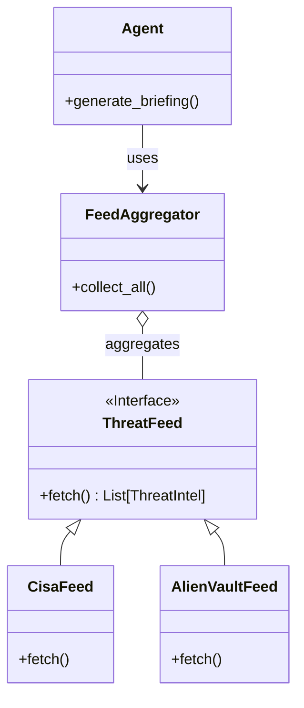

# 🛡️ AI Threat Intel & Vulnerability Monitor


**An automated Cyber Threat Intelligence (CTI) agent that aggregates vulnerabilities from multiple authoritative sources (CISA, NVD, AlienVault), filters out the noise, and delivers an AI-generated Executive Briefing to security leadership.**

Most threat feeds are noisy firehoses. This agent acts as a **Level 1 Analyst**, applying a strict **Risk Decision Matrix** and using Generative AI (LLM) to synthesize a "Bottom Line Up Front" (BLUF) strategic summary.

## ✨ Key Features

* **🛡️ Modular Feed Architecture:** New `FeedAggregator` pattern allows for plug-and-play addition of threat sources (e.g., CISA, AlienVault, CrowdStrike) without refactoring core logic.
* **🌐 Multi-Source Aggregation:** Ingests data from **CISA KEV** (Critical Enforcement) and **AlienVault OTX** (Emerging Threats).
* **🧠 Risk Decision Matrix:** Automatically prioritizes threats based on:
    * **Criticality:** CVSS Score > 7.0
    * **Credibility:** Source Priority (e.g., CISA warnings override CVSS scores).
* **🤖 AI Executive Briefings:** Uses OpenAI to generate clean, strategic summaries suitable for CISOs, focusing on business impact and actionable steps.

## 🛠️ Architecture


```mermaid
classDiagram
    class ThreatFeed {
        <<Interface>>
        +fetch() List[ThreatIntel]
    }
    class CisaFeed {
        +fetch()
    }
    class AlienVaultFeed {
        +fetch()
    }
    class FeedAggregator {
        +collect_all()
    }
    class Agent {
        +generate_briefing()
    }

    ThreatFeed <|-- CisaFeed
    ThreatFeed <|-- AlienVaultFeed
    FeedAggregator o-- ThreatFeed : aggregates
    Agent --> FeedAggregator : uses
```

## 🚀 Usage

### 1. Installation

```bash
git clone [https://github.com/codyjkeller/ai-threat-intel-agent.git](https://github.com/codyjkeller/ai-threat-intel-agent.git)
cd ai-threat-intel-agent
pip install -r requirements.txt
```

### 2. Configuration

The agent uses `.env` for secure credential management.

1. Rename `.env.example` to `.env`:

   ```bash
   cp .env.example .env
   ```

2. Add your API keys (optional, agent runs in fallback mode without them):

   ```ini
   OPENAI_API_KEY=sk-your-key
   OTX_API_KEY=your-otx-key
   ```

### 3. Run the Monitor

**Standard Mode (Console Output)**
Aggregates feeds, filters threats, and generates the AI Briefing.

```bash
python src/agent.py
```

## 📊 Sample Output

### CLI Console Logs

```text
2026-02-04 08:00:01 - [INTEL_AGENT] - 🤖 AI Threat Intelligence Agent v2.0
2026-02-04 08:00:01 - [INTEL_AGENT] - Target: Multi-Source Aggregation
2026-02-04 08:00:02 - [INTEL_AGENT] - 📡 Polling CISA KEV Feed...
2026-02-04 08:00:02 - [INTEL_AGENT] - 👽 Polling AlienVault OTX...
2026-02-04 08:00:03 - [INTEL_AGENT] - ✓ Processed 15 records from 2 sources.
```

### AI Executive Briefing (Generated)

> **EXECUTIVE THREAT BRIEFING**
>
> **Strategic Impact:**
> Active exploitation of **Citrix NetScaler (CVE-2025-1001)** poses an immediate risk to perimeter integrity, potentially allowing unauthenticated remote access to internal networks.
>
> **Actionable Steps:**
> 1. **Block:** Immediately enforce geoblocking and rate-limiting on NetScaler VIPs.
> 2. **Patch:** Apply emergency hotfix v14.1 within the next 4 hours.
> 3. **Hunt:** Review gateway logs for unauthorized sessions originating from unknown IPs in the last 24h.

## 📜 License

MIT
