```markdown
# 🛡️ AI Threat Intel & Vulnerability Monitor


**An automated Vulnerability Management engine that monitors official government databases (NVD), filters for *your* specific tech stack, and alerts your team in real-time.**

Most threat intel tools are just "news aggregators." This agent is a **filter**. It connects directly to the NIST National Vulnerability Database (NVD) API to determine if a new CVE actually affects your specific infrastructure (e.g., "Kubernetes", "AWS", "React") before waking you up.

## ✨ Key Features

* **🇺🇸 NVD Direct Integration:** Queries the NIST National Vulnerability Database API every 24 hours for authoritative CVE data.
* **🎯 Tech Stack Filtering:** Ignores noise by filtering threats against your defined assets.
* **🚨 Real-Time Slack Alerts:** Pushes "Critical" and "High" severity vulnerabilities directly to your security channel with a formatted report.
* **🧠 Context-Aware:** Eliminates "alert fatigue" by only flagging CVEs that match your `WATCHLIST`.

## 🛠️ Architecture

```mermaid
graph LR
    A[NIST NVD API] -->|Raw CVEs| D{Relevance Engine}
    
    D -->|Filter by Tech Stack| E[Risk Scorer]
    
    E -->|Score > 8| F[Slack Alert 🚨]
    E -->|Low Priority| G[Log to Console 📝]

```



## 🚀 Usage

### 1. Installation

```bash
git clone [https://github.com/codyjkeller/ai-threat-intel-agent.git](https://github.com/codyjkeller/ai-threat-intel-agent.git)
cd ai-threat-intel-agent
pip install -r requirements.txt

```

### 2. Configuration

Create a `.env` file in the root directory to configure your Slack webhook (optional):

```bash
# Required for Real-Time Alerts
SLACK_WEBHOOK_URL=[https://hooks.slack.com/services/T000](https://hooks.slack.com/services/T000)...

```

### 3. Define Your Stack

Open `src/main.py` and update the `WATCHLIST` to match your infrastructure:

```python
# The agent will only alert on these technologies
WATCHLIST = ["Kubernetes", "AWS", "Python", "React", "PostgreSQL"]

```

### 4. Run the Monitor

```bash
python src/main.py

```

## 📊 Sample Output

### CLI Console

```text
🛡️  Starting AI Threat & Vulnerability Monitor...
📡 Querying NVD for CVEs (Last 24h)...
✅ Found 45 new CVEs.
🚨 Detected 1 Critical Vulnerabilities matching stack!
   - CVE-2024-1234 (KUBERNETES): Attackers can bypass authentication...
✅ Slack alert sent for CVE-2024-1234

```

### Slack Alert

The agent sends formatted cards to Slack for immediate visibility:

> **🚨 Critical Alert: CVE-2024-1234**
> * **Tech:** KUBERNETES
> * **Severity:** High / Critical
> * **Description:** Attackers can bypass authentication in the kubelet API...
> * [ View Official Report ]
> 
> 

## 📜 License

MIT

```

```
